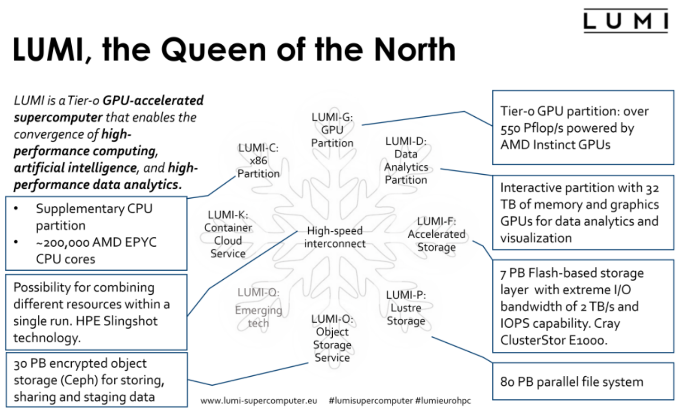
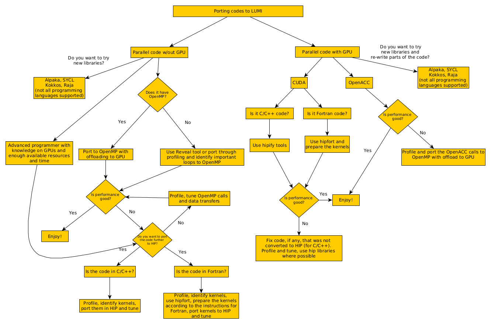

.. _introduction:

Introduction
============

.. questions::

   - Where does HIP come from?
   - What is the purpose of porting CUDA code to HIP?

.. objectives::

   - Learn where HIP comes from and how it fits into the HPC landscape
   - Understand why researchers may need to start thinking about porting their codes to HIP

Introduction
------------

Porting your code to LUMI and Dardel
------------------------------------

.. keypoints::

   - K1

     
