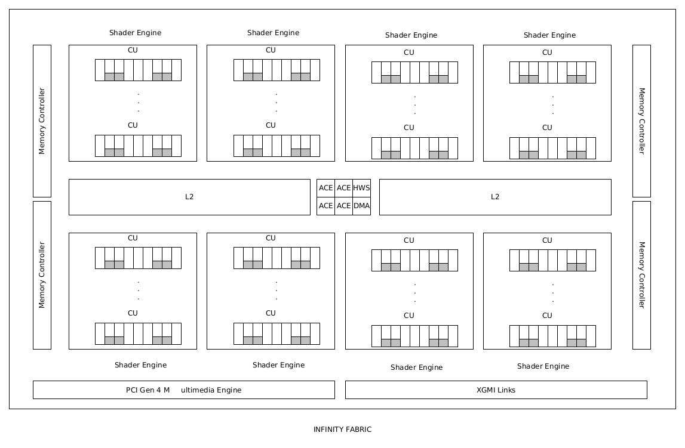
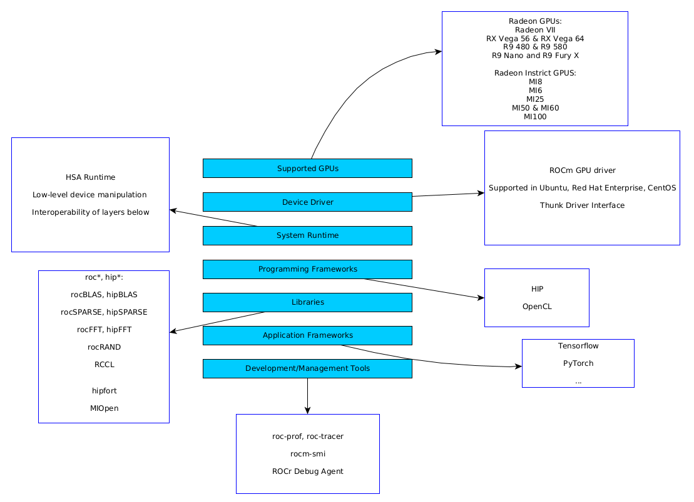

.. _introduction:

AMD architecture and ROCm
=========================

.. questions::

   - What are the specifics of the AMD architecture?
   - What is ROCm?
     
.. objectives::

   - Get familiar with the architecture of AMD GPUs
   - Get an overview of the ROCm software stack

AMD GPUs
--------

The ROCm software stack
-----------------------

.. keypoints::

   - K1
